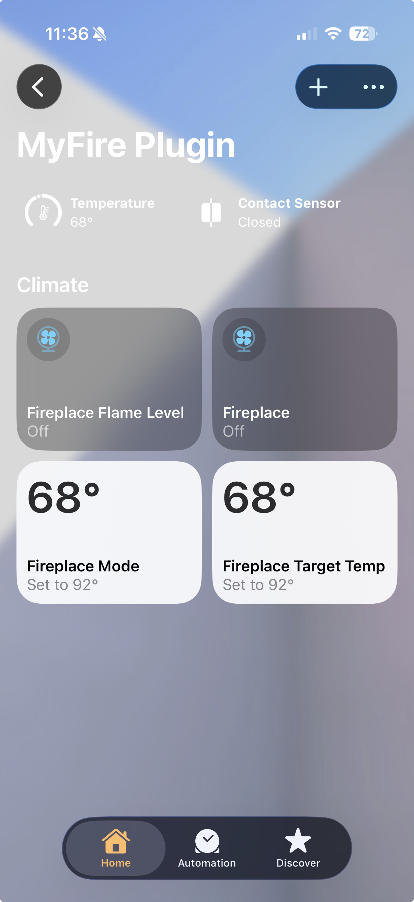

# homebridge-mertik-fireplace-myfire

[](https://www.npmjs.com/package/homebridge-mertik-fireplace-myfire)
[](https://www.npmjs.com/package/homebridge-mertik-fireplace-myfire)

Homebridge plugin for controlling Mertik / Maxitrol WiFi fireplace controllers with a Home app layout that works better alongside the MyFire app.



## What This Fork Changes

This fork is based on the original [`tritter/homebridge-mertik-fireplace`](https://github.com/tritter/homebridge-mertik-fireplace) project and keeps the original Apache-2.0 license.

The main differences in this fork are:

- Exposes separate Apple Home accessories for power, mode, target temperature, flame level, and connectivity
- Uses faster command timing for mode, flame, and target temperature changes
- Provides a finer-grained 12-step flame level control
- Keeps the original conservative on/off timing for fireplace safety transitions
- Keeps the main `Fireplace` switch as the only control that can power the fireplace on

## Compatibility

- Homebridge `1.11.x`
- Homebridge `2.0.0-beta.x`

## Home App Layout

Each configured fireplace is exposed as separate accessories:

- `Fireplace`: on/off switch
- `Fireplace Mode`: thermostat-style mode selector
  - `Heat` = Manual
  - `Auto` = Temperature
  - `Cool` = Eco
  - only changes mode while the fireplace is already on
- `Fireplace Target Temp`: thermostat for target temperature changes
- `Fireplace Flame Level`: fan-speed style flame control
- `Fireplace Connected`: contact sensor for reachability / automations

## Install

```bash
npm install -g --unsafe-perm homebridge-mertik-fireplace-myfire
```

You can also install it from the Homebridge UI plugin search once npm indexing catches up.

For Homebridge v2 beta:

```bash
npm install -g --unsafe-perm homebridge@beta
npm install -g --unsafe-perm homebridge-mertik-fireplace-myfire
```

## Homebridge Configuration

Update your Homebridge `config.json`:

```json
{
  "platforms": [
    {
      "platform": "MertikFireplaceMyFire",
      "fireplaces": [
        {
          "name": "Fireplace",
          "ip": "192.168.1.111"
        }
      ]
    }
  ]
}
```

## Migration From The Original Plugin

If you are moving from `homebridge-mertik-fireplace` or an earlier local custom build:

1. Remove the old fireplace accessories from Apple Home.
2. Uninstall the old plugin package from Homebridge.
3. Install `homebridge-mertik-fireplace-myfire`.
4. Update your config to use `"platform": "MertikFireplaceMyFire"`.
5. Restart Homebridge and add the accessories again.

## Release Process

This repo includes a GitHub Actions workflow that creates a GitHub release automatically when you push a tag matching:

```bash
myfire-v*
```

Typical flow:

1. Bump `package.json` to the new version.
2. Publish the package to npm.
3. Create a matching tag such as `myfire-v1.0.3`.
4. Push the tag to GitHub:

```bash
git push origin myfire-v1.0.3
```

GitHub Actions will create the release and generate release notes automatically.

## Configuration Options

| Key | Default | Description |
| --- | --- | --- |
| `platform` | `"MertikFireplaceMyFire"` | Required. The platform name used by Homebridge. |
| `fireplaces` | `[]` | Required. Array of configured fireplaces. |
| `name` | `"Fireplace"` | Required. Display name for the fireplace. This is also used in accessory identity, so renaming it creates new accessories. |
| `ip` | `"192.168.1.111"` | Required. Static IP address of the fireplace controller. |

## Notes

- The main `Fireplace` switch is the only control that powers the fireplace on, and it defaults to Manual mode.
- Mode changes are ignored while the fireplace is off.
- Flame level changes only apply while the fireplace is already in Manual mode.
- Target temperature changes only apply while the fireplace is in Temperature mode.
- The plugin expects each fireplace controller to keep a stable IP address.
- Apple Home will show the mode selector as a thermostat-style control because HomeKit does not provide a native three-state mode selector service.

## Legal

*Mertik* is a registered trademark of Maxitrol GmbH & Co. KG.

This project is not affiliated with, authorized, maintained, sponsored, or endorsed by Maxitrol or any of its affiliates.

## Credits

- Original project: [`tritter/homebridge-mertik-fireplace`](https://github.com/tritter/homebridge-mertik-fireplace)
- Prior related work referenced by the original plugin: [`erdebee/homey-mertik-wifi`](https://github.com/erdebee/homey-mertik-wifi)
